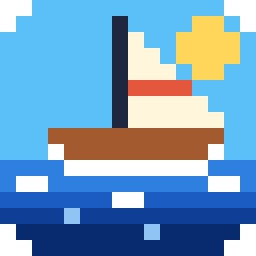

<p align="center"></p>

# Deep Sea

*The Legend of Zelda: The Wind Waker* (USA GameCube disc, `GZLE01`) as a
native Windows game: recompiled code, a real 60 fps, true 16:9 widescreen,
controller support and a cutscene skip. You build it from your own disc;
nothing from the game is included.

Deep Sea is a fork of [ModernGekko](https://github.com/ExpansionPak/ModernGekko),
a runtime for GameCube/Wii recompilations.

**Website:** https://ah64-dll.github.io/DeepSea/ ·
**Download:** [latest release](https://github.com/AH64-dll/DeepSea/releases/latest)

## Play

1. Download `DeepSea-*-win64.zip` from Releases and unzip it.
2. Run `DeepSea.exe` (or `Play Deep Sea.cmd`) and choose your own
   extracted USA disc. The launcher can also unpack an ISO, WBFS or RVZ of
   your copy.
3. The first launch builds the game module from your disc. This takes
   30-90 minutes, depending on your CPU, and shows a progress bar. Later
   launches start right away.

Requirements: Windows 10/11 x64, a Vulkan 1.1 GPU, and about 2 GB of free
space during setup. The full players' guide is
[`packaging/README-PLAYERS.md`](packaging/README-PLAYERS.md).

## No game code or data is distributed

The recompiled module (`gGZLE01_recomp.dll`) is never shipped. Releases carry
a setup kit ([`scripts/disc_builder`](scripts/disc_builder/README.md)) that
translates the game's code from the player's own disc, on the player's PC:

- It checks the disc files against SHA-256 hashes in
  [`gzle01.json`](scripts/disc_builder/gzle01.json).
- It translates `main.dol` and the 415 REL modules with DolRecomp.
- It verifies the translated C against the hashes of the tested build.
- It compiles the result with a bundled llvm-mingw for the player's CPU.

This repository and the release downloads contain no disc images, extracted
game files, translated game code, artwork, audio or save data. Game-specific
knowledge is limited to guest addresses the runtime and mods hook, and
hashes.

## Wind Waker features

| Mod / system | What it does | Off switch |
|---|---|---|
| `mods/frame60-accum` | Renders interpolated frames at 60 fps, locked to the display refresh; drops to 30 fps on slow PCs instead of slowing the game | `MODERNGEKKO_FRAME60_ACCUM=0` |
| `mods/widescreen16x9` | Native port of the GZLE01 widescreen code: wider camera and relocated HUD | `aspect_ratio=4:3` or `MODERNGEKKO_WIDESCREEN=0` |
| `mods/cutscene-skip` | Hold Z + Start to skip cutscenes | `MODERNGEKKO_CUTSCENE_SKIP=0` |
| Launcher | Disc/ISO picker, controller remapping, graphics options, savestates, first-launch game setup | |

Implementation notes are in [`docs/WINDOWS-PORT-STATUS.md`](docs/WINDOWS-PORT-STATUS.md).

## Build from source

Requirements: [llvm-mingw](https://github.com/mstorsjo/llvm-mingw) (UCRT,
x86_64) on `PATH`, CMake 3.20+, Ninja, Git and Python 3.

```sh
git clone --recursive https://github.com/AH64-dll/DeepSea
cd DeepSea
cmake --preset windows-mingw-release-opt
cmake --build build-windows/build-windows-mingw-release-opt
```

Assemble a release with the setup kit:

```sh
python scripts/disc_builder/make_kit.py --out kit \
    --dolrecomp build-windows/build-windows-mingw-release-opt/dolrecomp.exe \
    --python-embed python-3.x-embed-amd64.zip --toolchain <llvm-mingw dir>
scripts/package-release.sh --build-dir build-windows/build-windows-mingw-release-opt \
    --builder-kit kit --out dist
```

## Legal

Deep Sea is free software under the GNU GPL v3 (see `LICENSE`). The
vendored Dolphin code is GPLv2-or-later, and the third-party notices live
beside their sources. The Legend of Zelda and The Wind Waker are trademarks of
Nintendo. This is an unofficial fan project, not affiliated with or endorsed
by Nintendo. You need your own legally obtained copy of the game.

## ModernGekko runtime

The engine underneath is ModernGekko, a general runtime for GameCube/Wii
recompilations. The rest of this file is its documentation.

### Code mods

The runner loads code mods from `Mods` beside the executable and from `<user-dir>/Mods` by default. It accepts package directories named `<id>.mgm` containing `mod.so`, `mod.dll`, or `mod.dylib`, and development libraries named `<id>.mgm.so`, `<id>.mgm.dll`, or `<id>.mgm.dylib`. Use `--mods <directory>` for another location or `--no-mods` to disable loading.

The mod ABI supports dependency ordering, minimum versions, optional dependencies, imports and exports, entry and return hooks, normal and forced function patches, events and callbacks, load callbacks, and exact disc/CPU ABI validation. Netplay fingerprints include every loaded package binary and its filename.

DolRecomp's optional MAP input emits named address constants for code mods. Literal addresses remain supported when a game has no MAP file. See `mod-template` for a minimal package.

## Credits

SpecialK / aharonahdoot - RecompCore (referenced heavily)

The Dolphin Team - Foundation of this repo

Literally God / MrPoloGit - Making the Recomp template and adding MacOS support

AH64-dll - Deep Sea, the Wind Waker port in this fork (60 fps, widescreen, disc builder)

[zeldaret/tww](https://github.com/zeldaret/tww) - The Wind Waker decompilation. Deep Sea's
hooks, fixes and native helpers rely on its work on the game's code.

Please contact me if your name is missing and you contributed something!

## Hall of Fame
binsento - Super Mario Sunshine & Super Smash Bros. Brawl recomp

MOOMAN - 007 AUF

me (Hyperway) Luigi's Mansion & Kirby Wii

Literally God / MrPoloGit - Super Smash Bros. Melee

Contact me to be added to the Hall of Fame
